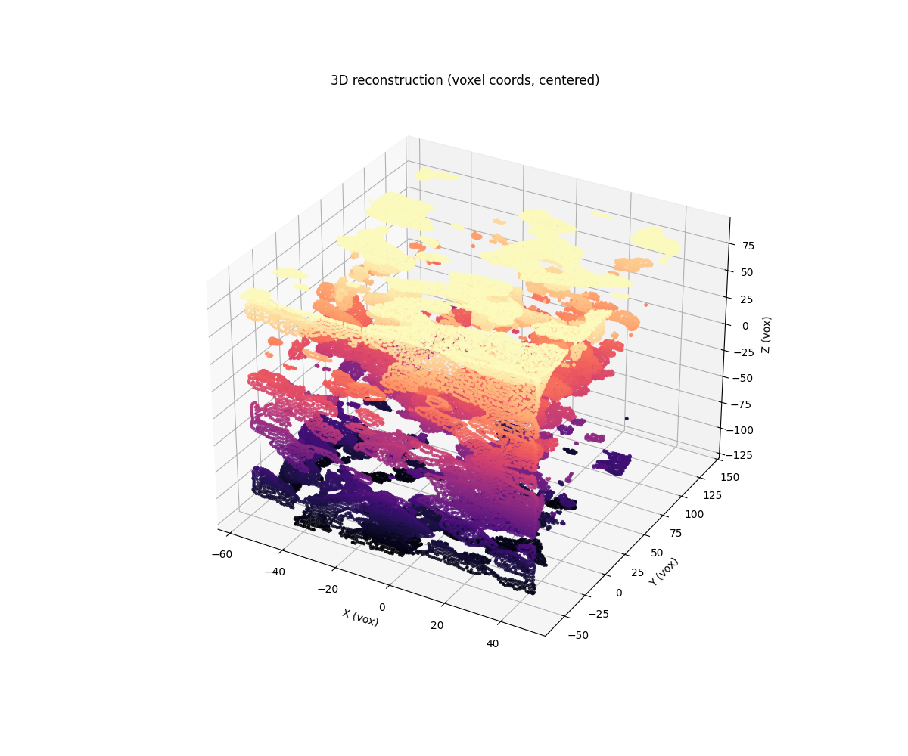
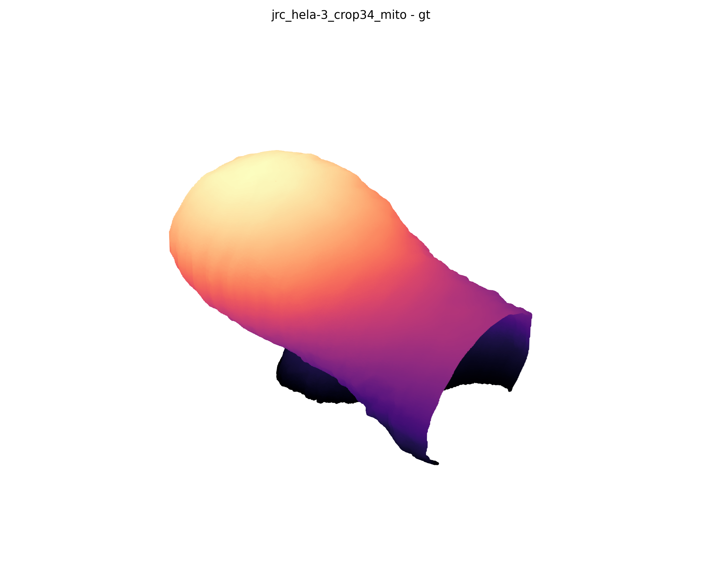
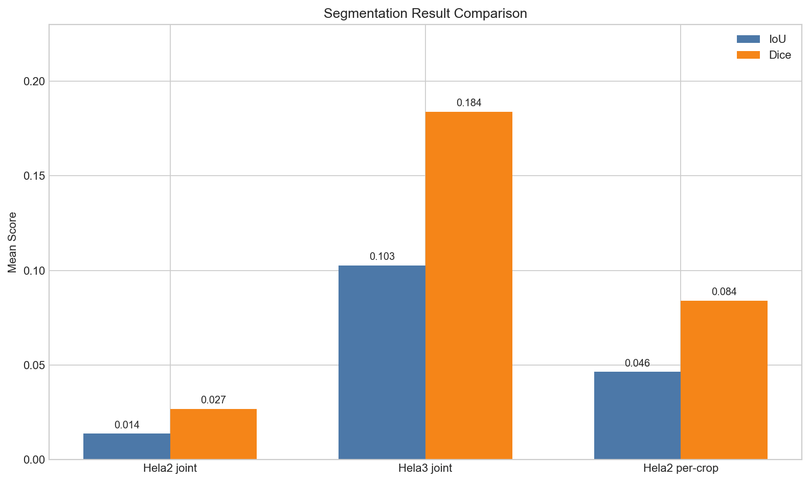
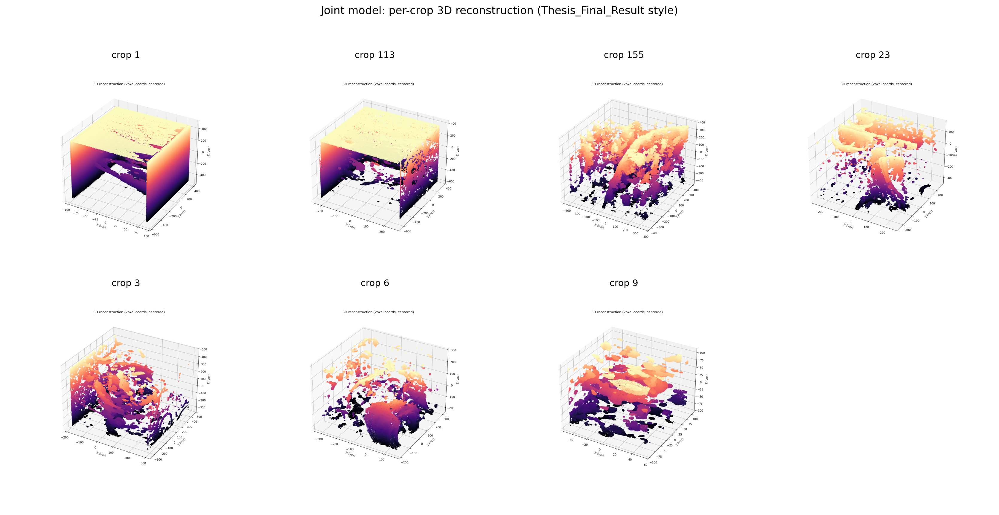
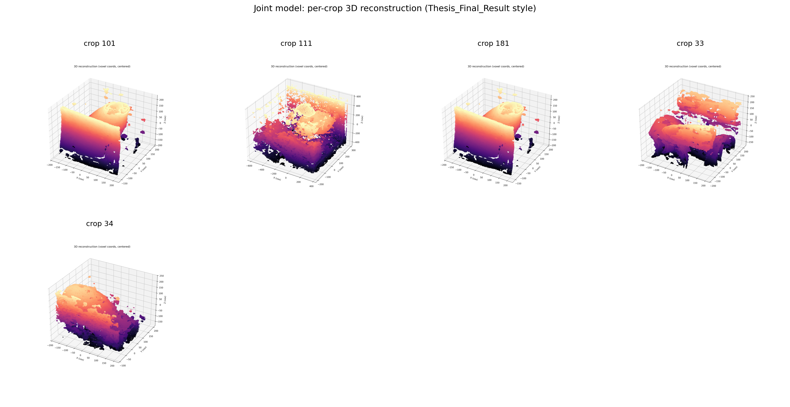
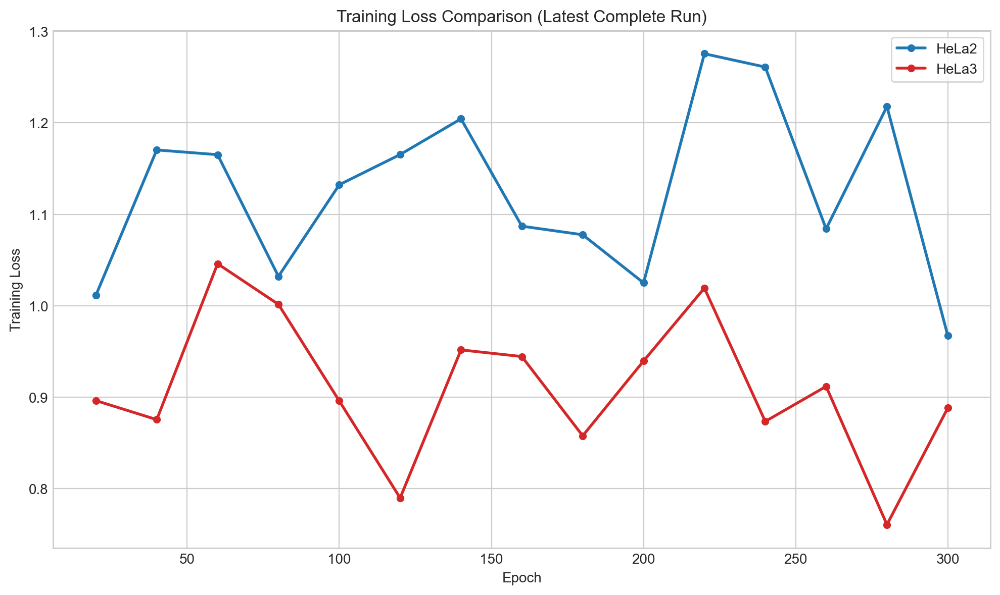
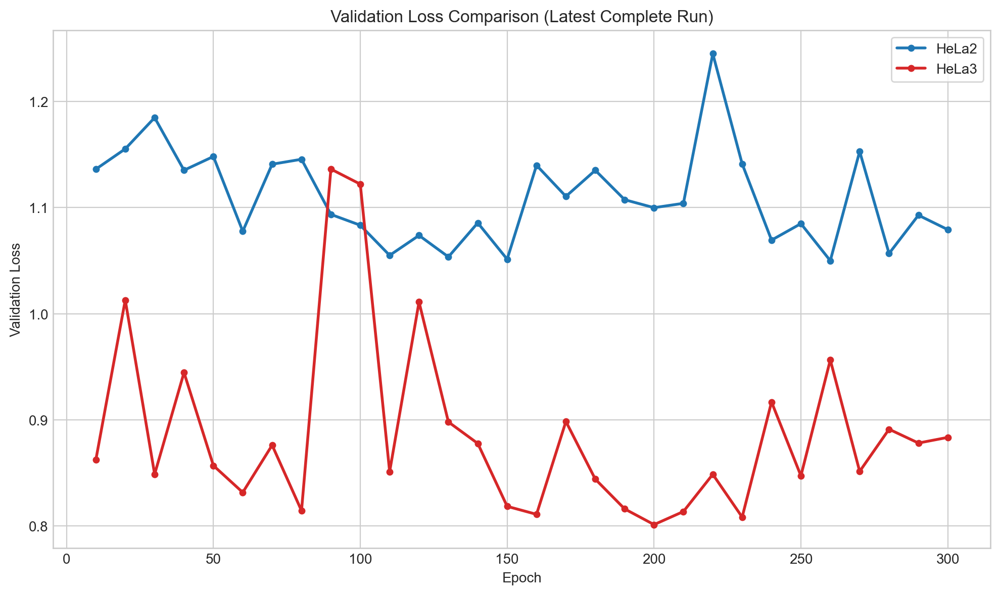

**English** | [简体中文](README.zh-CN.md)

# Simplified Convolutional Occupancy Network Based 3D Reconstruction for Mitochondria

<p align="center">
  
</p>

<p align="center">
  
  
</p>

## Project Summary

This repository accompanies an undergraduate thesis on **three-dimensional reconstruction of mitochondria** from volumetric electron microscopy data. The project implements a simplified convolutional occupancy network pipeline that learns a point-wise occupancy function from FIB-SEM / OpenOrganelle-style crops and converts dense occupancy predictions into explicit meshes through Marching Cubes.

Rather than treating the task as direct voxel segmentation alone, the project models mitochondrial shape reconstruction as a continuous occupancy prediction problem. This design supports mesh extraction, visual inspection, thesis-ready figure generation, and quantitative validation in a unified workflow.

## Research Scope

The thesis-associated implementation focuses on three practical questions:

1. whether a simplified ConvONet-style model can produce coherent and inspectable mitochondrial meshes;
2. whether reconstruction behavior differs substantially across domains such as HeLa2 and HeLa3;
3. whether overlap-based metrics and surface-distance metrics may diverge under the same design change.

Accordingly, this repository should be read as an experimental research pipeline rather than a fully generalized production framework.

## Method Pipeline

<p align="center">
  
  
  
</p>

The workflow consists of four major stages:

1. **Volume loading and crop construction**  
   Raw EM volumes and mitochondrial labels are loaded from OpenOrganelle-compatible paths or exported crop Zarr files.

2. **Occupancy learning**  
   A lightweight 3D convolutional encoder extracts local volumetric features, while normalized query coordinates are decoded by an MLP to predict point occupancy.

3. **Explicit surface reconstruction**  
   Dense occupancy probabilities are evaluated across 3D space and converted into meshes with Marching Cubes.

4. **Validation and visualization**  
   The generated mesh is compared against binary labels using voxel and surface-related metrics, and exported as figures, OBJ meshes, and animated GIFs.

## Actual Main Workflow in This Repository

The current thesis-oriented workflow is organized around [hela2_mito_pipeline.py](hela2_mito_pipeline.py), with execution delegated to [train.py](train.py), [generate.py](generate.py), and [validate_crop.py](validate_crop.py).

Primary scripts:

- [hela2_mito_pipeline.py](hela2_mito_pipeline.py): orchestration entry for `joint`, `per-crop`, and `infer-all`
- [train.py](train.py): model training
- [generate.py](generate.py): inference, occupancy-field reconstruction, and mesh extraction
- [validate_crop.py](validate_crop.py): crop-level mesh-vs-label evaluation
- [export_hela2_np_s0_mito_masked.py](export_hela2_np_s0_mito_masked.py): crop export utility

Legacy demo-oriented paths remain in the repository, but they no longer represent the main experimental route documented in the thesis.

## Repository Structure

```text
Mito3D_Reconstruction_Thesis/
├─ environment.yml
├─ hela2_mito_pipeline.py
├─ train.py
├─ generate.py
├─ validate_crop.py
├─ export_hela2_np_s0_mito_masked.py
├─ run_hela2_mito_training.py
├─ data/
├─ src/
├─ scripts/
├─ checkpoints/
├─ result/
├─ thesis/
├─ Thesis_Final_Result.png
├─ preview_result.png
└─ Mito3D_Rotation_Showcase.gif
```

## Environment Setup

The recommended setup uses [environment.yml](environment.yml):

```bash
conda env create -f environment.yml
conda activate mito3d_env
python -c "import torch; print(torch.__version__, torch.cuda.is_available())"
```

## Quick Start

### Joint model training

```bash
python hela2_mito_pipeline.py joint --epochs 300
```

### Per-crop training and reconstruction

```bash
python hela2_mito_pipeline.py per-crop --only-crop 9 --epochs 300
```

### Batch inference and validation

```bash
python hela2_mito_pipeline.py infer-all --checkpoint checkpoints/model_hela2_all_mito.pth --validate
```

### Direct script usage

```bash
python train.py --data_root data --dataset jrc_hela-2 --crop_id 94 --epochs 300
python generate.py --data_root data --dataset jrc_hela-2 --crop_id 94 --checkpoint checkpoints/model_final.pth
python validate_crop.py --data_root data --dataset jrc_hela-2 --crop_id 94 --mesh result/final_mitochondria.obj
```

## Data and Outputs

Typical inputs include:

- OpenOrganelle / OME-Zarr volume layouts;
- exported mitochondrial crop Zarr files.

Typical outputs include:

- trained checkpoints in `checkpoints/`;
- inference reports and montages in `result/`;
- reconstructed `.obj` meshes;
- thesis-ready `.png` figures;
- animated `.gif` visualizations.

## Result Gallery

<p align="center">
  
  
</p>

<p align="center">
  
  
</p>

These figures illustrate representative reconstructions, cross-domain montage comparisons, and training/validation behavior used in the final thesis narrative.

## Thesis Context

This repository supports the thesis **“Simplified Convolutional Occupancy Network Based 3D Reconstruction for Mitochondria.”** The thesis documents a lightweight 3D encoder + query MLP design, BCE + Dice training, mesh extraction through Marching Cubes, and empirical differences between HeLa2 and HeLa3 reconstruction behavior.

For that reason, the repository description intentionally follows the thesis framing and experimental scope, instead of presenting the codebase as a domain-agnostic general-purpose package.

## Limitations

- Some legacy files and early demo paths are still retained for reference.
- Reconstruction quality varies substantially across domains and fields of view.
- Several scripts were designed primarily for thesis evaluation and presentation.
- Metric interpretation depends on crop difficulty, inference mode, and post-processing settings.

## Citation

If you use this repository in academic writing or project presentation, please cite the associated thesis version and report the dataset domain, training mode, and validation setup used in your results.
