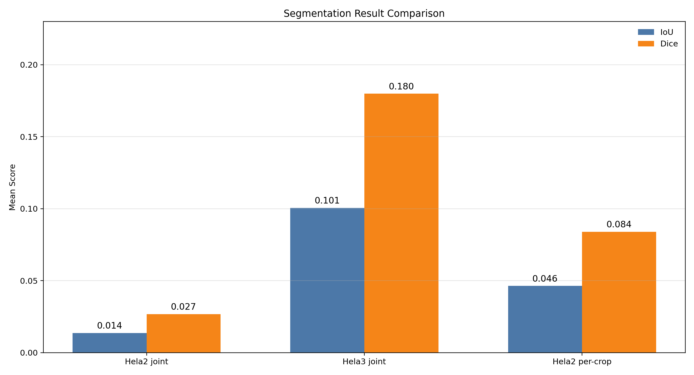

# Simplified Convolutional Occupancy Network Based 3D Reconstruction for Mitochondria

<p align="center">
  
  
</p>

---

# 中文介绍

## 项目概述

本项目面向本科毕业论文与科研展示场景，研究对象为**线粒体的三维重建**。项目基于简化卷积占据网络（simplified convolutional occupancy network, ConvONet-style pipeline），从 FIB-SEM / OpenOrganelle 体系下的三维电子显微镜体数据中学习空间占据函数，并通过 Marching Cubes 从预测概率场中提取显式网格，用于结果分析、论文写作和可视化展示。

与直接体素分割不同，本项目将三维形状恢复表述为对查询点占据概率的预测问题。该设计使模型能够在连续空间中估计目标结构，并最终生成可检查、可导出、可演示的三维网格结果。

## 研究目标

本项目对应的论文工作聚焦于以下问题：

1. 简化卷积占据网络是否能够在线粒体 crop 上生成连贯、可检查的三维网格；
2. 不同数据域（尤其是 HeLa2 与 HeLa3）是否会导致显著不同的重建表现；
3. 体素重叠指标与表面距离指标是否会在同一设计改动下呈现不一致趋势。

因此，本仓库既是代码实现，也是论文实验流程的工程化载体。

## 方法流程

<p align="center">
  
  
  
</p>

整体流程可概括为四个阶段：

1. **数据读取与裁剪**  
   从 OpenOrganelle / crop export Zarr 中读取原始 EM 体数据与线粒体标签，构造训练与推理所需的三维 crop。

2. **占据学习**  
   使用轻量 3D 卷积编码器提取局部体特征；对归一化查询坐标进行采样，并通过 MLP 预测每个点是否属于线粒体内部。

3. **显式表面重建**  
   在三维空间上密集评估占据概率，形成概率体后利用 Marching Cubes 提取等值面，得到 `.obj` 网格。

4. **定量验证与可视化**  
   使用 mesh-vs-label 评估流程计算 voxel IoU、voxel Dice 与 Chamfer 类指标，同时导出 PNG、OBJ 与 GIF 以支持论文和答辩展示。

## 当前仓库中的真实主流程

> 当前仓库的主实验流程以 [hela2_mito_pipeline.py](hela2_mito_pipeline.py) 为入口；旧版以 `sample.zarr` 和 `evaluate.py` 为核心的演示流程仍保留在仓库中，但**不再代表当前论文主线**。

核心脚本如下：

- [hela2_mito_pipeline.py](hela2_mito_pipeline.py)：主流程调度入口，支持 `joint`、`per-crop`、`infer-all`
- [train.py](train.py)：训练 ConvONet 风格占据预测模型
- [generate.py](generate.py)：进行推理、重建概率体并提取三维网格
- [validate_crop.py](validate_crop.py)：对单个 crop 的 mesh 与标签进行定量验证
- [export_hela2_np_s0_mito_masked.py](export_hela2_np_s0_mito_masked.py)：导出可用于训练的 crop Zarr 数据

## 仓库结构

```text
Mito3D_Reconstruction_Thesis/
├─ environment.yml
├─ hela2_mito_pipeline.py
├─ train.py
├─ generate.py
├─ validate_crop.py
├─ export_hela2_np_s0_mito_masked.py
├─ run_hela2_mito_training.py
├─ data/
├─ src/
├─ scripts/
├─ checkpoints/
├─ result/
├─ thesis/
├─ Thesis_Final_Result.png
├─ preview_result.png
└─ Mito3D_Rotation_Showcase.gif
```

## 环境配置

建议优先使用仓库内的 [environment.yml](environment.yml) 创建 Conda 环境：

```bash
conda env create -f environment.yml
conda activate mito3d_env
python -c "import torch; print(torch.__version__, torch.cuda.is_available())"
```

如果在 Windows + NVIDIA GPU 环境中遇到 CUDA 不可用，可检查 PyTorch 是否被安装为 CPU 版本，或是否发生了 `pip`/`conda` 混装导致的 `numpy` 兼容问题。

## 快速开始

### 1. Joint training

```bash
python hela2_mito_pipeline.py joint --epochs 300
```

该模式在指定数据域上训练一个联合模型。默认情况下，HeLa2 与 HeLa3 会使用各自的默认 checkpoint 命名策略。

### 2. Per-crop training

```bash
python hela2_mito_pipeline.py per-crop --only-crop 9 --epochs 300
```

该模式针对单个 crop 单独训练、单独生成网格并可进一步执行验证，适合论文中的逐视野分析。

### 3. Batch inference on a trained checkpoint

```bash
python hela2_mito_pipeline.py infer-all --checkpoint checkpoints/model_hela2_all_mito.pth --validate
```

该模式会对多个 crop 批量执行推理，并在启用 `--validate` 时输出逐 crop 评估结果与汇总统计。

### 4. 单脚本入口（按需）

```bash
python train.py --data_root data --dataset jrc_hela-2 --crop_id 94 --epochs 300
python generate.py --data_root data --dataset jrc_hela-2 --crop_id 94 --checkpoint checkpoints/model_final.pth
python validate_crop.py --data_root data --dataset jrc_hela-2 --crop_id 94 --mesh result/final_mitochondria.obj
```

## 数据与输出

### 输入数据

项目当前主要围绕以下两类数据入口组织：

- **OpenOrganelle / OME-Zarr 路径**：直接读取 HeLa 数据及其 crop 标签；
- **crop export Zarr 路径**：将线粒体相关 crop 导出为更直接的训练/推理输入。

### 典型输出

- `checkpoints/*.pth`：训练得到的模型权重；
- `result/**`：推理结果、拼图、指标统计与验证输出；
- `.obj`：三维网格模型；
- `.png`：论文和汇报可直接使用的高分辨率图像；
- `.gif`：旋转展示动画。

## 实验可视化

<p align="center">
  
  
</p>

<p align="center">
  
  
</p>

这些图像来自当前论文与实验输出，分别对应：

- 代表性重建结果；
- HeLa2 / HeLa3 联合推理拼图；
- 训练与验证损失曲线；
- 重建结果与标签之间的视觉比较。

## 与论文的关系

本仓库服务于论文 **“Simplified Convolutional Occupancy Network Based 3D Reconstruction for Mitochondria”** 的实验实现与结果展示。论文摘要中强调：

- 模型采用轻量 3D 卷积编码器 + 点查询 MLP；
- 训练目标使用 BCE 与 Dice loss 以缓解前景稀疏问题；
- 推理阶段将稠密占据概率体转化为显式网格；
- HeLa2 与 HeLa3 数据域在结果上呈现明显差异；
- overlap 指标与 surface-distance 指标可能在同一设计改动下出现分歧。

因此，README 中的介绍会尽量与最终论文口径保持一致，而不是将该仓库描述为一个完全产品化的通用工具箱。

## 局限性说明

- 当前仓库中的部分旧脚本与旧说明仍然保留，可能反映项目早期 demo 阶段；
- 不同数据域的结果差异较大，尤其是更困难视野上的表现仍有限；
- 某些可视化脚本更偏论文展示用途，而非大规模自动化生产流程；
- 指标解释需要结合具体 crop、具体推理模式与后处理设置，不能孤立理解单一数值。

## Citation

如果你在学术写作或展示中使用本仓库，请优先引用对应论文版本，并在必要时说明所使用的数据域、训练模式与验证设置。

---

# English Overview

## Project Summary

This repository accompanies an undergraduate thesis on **three-dimensional reconstruction of mitochondria** from volumetric electron microscopy data. The project implements a simplified convolutional occupancy network pipeline that learns a point-wise occupancy function from FIB-SEM / OpenOrganelle-style crops and converts dense occupancy predictions into explicit meshes through Marching Cubes.

Rather than treating the task as direct voxel segmentation alone, the project models mitochondrial shape reconstruction as a continuous occupancy prediction problem. This design supports mesh extraction, visual inspection, thesis-ready figure generation, and quantitative validation in a unified workflow.

## Research Scope

The thesis-associated implementation focuses on three practical questions:

1. whether a simplified ConvONet-style model can produce coherent and inspectable mitochondrial meshes;
2. whether reconstruction behavior differs substantially across domains such as HeLa2 and HeLa3;
3. whether overlap-based metrics and surface-distance metrics may diverge under the same design change.

Accordingly, this repository should be read as an experimental research pipeline rather than a fully generalized production framework.

## Method Pipeline

<p align="center">
  
  
  
</p>

The workflow consists of four major stages:

1. **Volume loading and crop construction**  
   Raw EM volumes and mitochondrial labels are loaded from OpenOrganelle-compatible paths or exported crop Zarr files.

2. **Occupancy learning**  
   A lightweight 3D convolutional encoder extracts local volumetric features, while normalized query coordinates are decoded by an MLP to predict point occupancy.

3. **Explicit surface reconstruction**  
   Dense occupancy probabilities are evaluated across 3D space and converted into meshes with Marching Cubes.

4. **Validation and visualization**  
   The generated mesh is compared against binary labels using voxel and surface-related metrics, and exported as figures, OBJ meshes, and animated GIFs.

## Actual Main Workflow in This Repository

The current thesis-oriented workflow is organized around [hela2_mito_pipeline.py](hela2_mito_pipeline.py), with execution delegated to [train.py](train.py), [generate.py](generate.py), and [validate_crop.py](validate_crop.py).

Primary scripts:

- [hela2_mito_pipeline.py](hela2_mito_pipeline.py): orchestration entry for `joint`, `per-crop`, and `infer-all`
- [train.py](train.py): model training
- [generate.py](generate.py): inference, occupancy-field reconstruction, and mesh extraction
- [validate_crop.py](validate_crop.py): crop-level mesh-vs-label evaluation
- [export_hela2_np_s0_mito_masked.py](export_hela2_np_s0_mito_masked.py): crop export utility

Legacy demo-oriented paths remain in the repository, but they no longer represent the main experimental route documented in the thesis.

## Environment Setup

The recommended setup uses [environment.yml](environment.yml):

```bash
conda env create -f environment.yml
conda activate mito3d_env
python -c "import torch; print(torch.__version__, torch.cuda.is_available())"
```

## Quick Start

### Joint model training

```bash
python hela2_mito_pipeline.py joint --epochs 300
```

### Per-crop training and reconstruction

```bash
python hela2_mito_pipeline.py per-crop --only-crop 9 --epochs 300
```

### Batch inference and validation

```bash
python hela2_mito_pipeline.py infer-all --checkpoint checkpoints/model_hela2_all_mito.pth --validate
```

### Direct script usage

```bash
python train.py --data_root data --dataset jrc_hela-2 --crop_id 94 --epochs 300
python generate.py --data_root data --dataset jrc_hela-2 --crop_id 94 --checkpoint checkpoints/model_final.pth
python validate_crop.py --data_root data --dataset jrc_hela-2 --crop_id 94 --mesh result/final_mitochondria.obj
```

## Data and Outputs

Typical inputs include:

- OpenOrganelle / OME-Zarr volume layouts;
- exported mitochondrial crop Zarr files.

Typical outputs include:

- trained checkpoints in `checkpoints/`;
- inference reports and montages in `result/`;
- reconstructed `.obj` meshes;
- thesis-ready `.png` figures;
- animated `.gif` visualizations.

## Result Gallery

<p align="center">
  
  
</p>

<p align="center">
  
  
</p>

These figures illustrate representative reconstructions, cross-domain montage comparisons, and training/validation behavior used in the final thesis narrative.

## Thesis Context

This repository supports the thesis **“Simplified Convolutional Occupancy Network Based 3D Reconstruction for Mitochondria.”** The thesis documents a lightweight 3D encoder + query MLP design, BCE + Dice training, mesh extraction through Marching Cubes, and empirical differences between HeLa2 and HeLa3 reconstruction behavior.

For that reason, the repository description intentionally follows the thesis framing and experimental scope, instead of presenting the codebase as a domain-agnostic general-purpose package.

## Limitations

- Some legacy files and early demo paths are still retained for reference.
- Reconstruction quality varies substantially across domains and fields of view.
- Several scripts were designed primarily for thesis evaluation and presentation.
- Metric interpretation depends on crop difficulty, inference mode, and post-processing settings.

## Citation

If you use this repository in academic writing or project presentation, please cite the associated thesis version and report the dataset domain, training mode, and validation setup used in your results.
